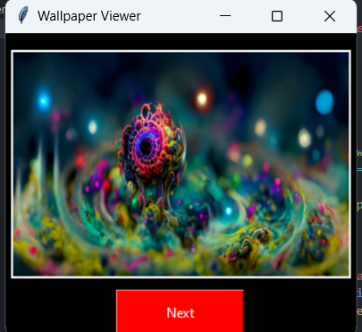
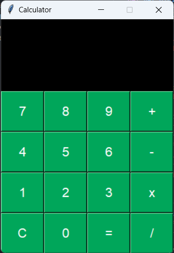
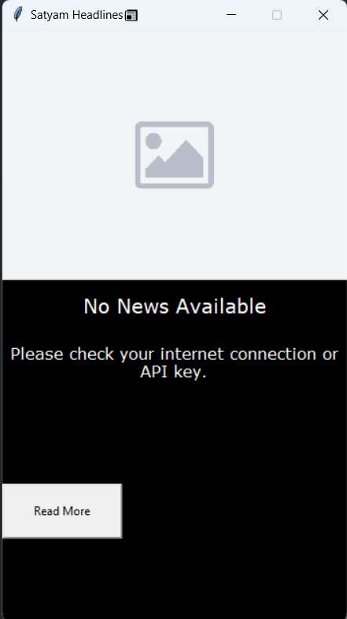

## Learning Tkinter Applications  

This repository showcases projects built using Python's Tkinter library, covering different GUI applications. Below are the project details with corresponding outputs.

---

### 1. **Wallpaper Viewer**  
A simple app to view wallpapers in a folder and rotate through them using the "Next" button.  

**Output:**  
| Application Screenshot |
|-------------------------|
|  |

---

### 2. **Calculator**  
A basic calculator application supporting addition, subtraction, multiplication, and division with error handling for invalid operations.  

**Output:**  
| Application Screenshot |
|-------------------------|
|  |

---

### 3. **News Application**  
Fetches the latest news using the NewsAPI and displays news headlines, descriptions, and images. Navigate through the news using "Prev" and "Next" buttons, and read the full article via the "Read More" button.  

**Output:**  
| Application Screenshot |
|-------------------------|
|  |

---

### Repository Link  
Access the code [here](https://github.com/SimpleCyber/Learning-Tkinter.git).  
